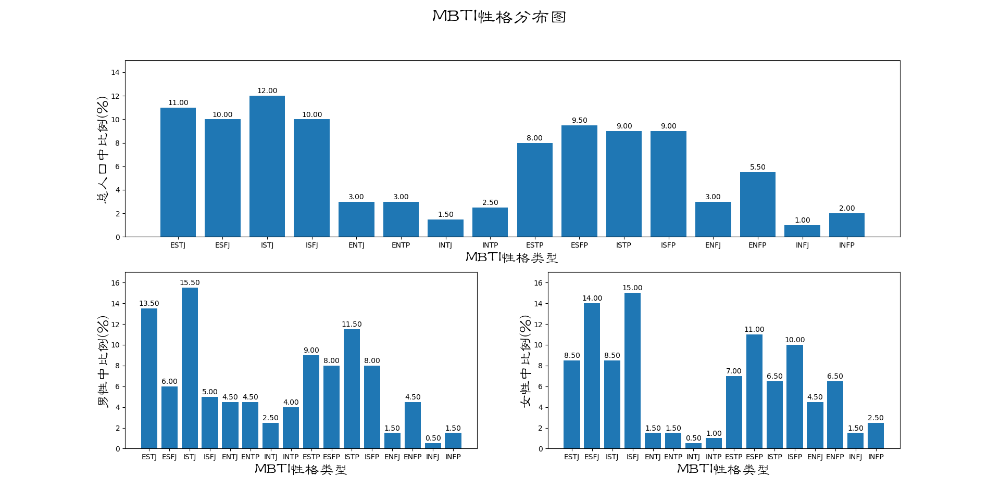

# Python

## getall.py
用于获取由指定网站中的指定后缀的文件

-h	查看帮助

-v	查看版本信息

-w	指定目标网站，应该是完整的URL地址

-A	指定目标文件后缀名，需含“.”,若有多个，则连在一起写，不用加空格

例如：

getall.py -w http://www.wangning.site -A .jpg.png

存在的问题：可能陷入url死循环而使程序停不下来。

## help.py
用于将python内置的帮助信息输出到文件

## T2与Mx的关系图.py
用于绘制T的平方和Mx的关系图

## tjdax.py
用于遍历tjdx学生证件照

## vuls2.0-beta.py
用于从NVD网站获取漏洞信息

## 弗郎和费衍射绘图.py
用于绘制弗郎和费衍射绘图

## 音叉U-f关系曲线.py
用于绘制音叉U-f关系曲线

## 2^16prime.py
用于计算2^16内的所有质数

## 2^16prime.txt
计算好的2^16内的所有质数

## 2^32prime.py
用于计算2^32内的所有质数

## caesar.py
凯撒加密

## pushbox.py
推箱子小游戏，
需要gifs文件夹下的gif文件支持。

## rateList.py
爬去天猫评论信息的爬虫，获得的数据保存于数据库中。
若想使用该程序，请进行如下操作：

### 1.配置邮箱
修改在程序开头处的管理员邮箱，这个邮箱会接收程序运行的错误信息和完成信息：

	receiver = ["xxx@xxx.xxx",]

正确配置函数 send163mail中的作为发件邮箱的163邮箱：

    sender = '************@163.com'  #设置发件邮箱，一定要自己注册的邮箱
    pwd = '************'  #设置发件邮箱的密码，等会登陆会用到

### 2.配置数据库
首先修改数据库配置部分：

	#在此处设置数据库连接信息
	db_config = {
	    "hostname": "localhost",#主机名
	    "username": "root",#数据库用户名
	    "password": "root",#数据库密码
	    "databasename": "test",#要存入数据的数据库名
	    }

然后进入Mysql执行一下语句创建数据库：

	CREATE DATABASE test DEFAULT charACTER SET utf8 COLLATE utf8_general_ci;

数据库名test可以随意修改，但两处要相同。
### 3.准备itemId.txt 和sellerId.txt

需要准备好各商品的itemId.txt 和sellerId.txt，同一类商品的itemId和sellerId分别存放在同一个文件中并放在以商品类别名命名的文件夹中，如下所示：

	 .
	├── abc
	│   ├── itemId.txt
	│   └── sellerId.txt
	├── def
	│   ├── itemId.txt
	│   └── sellerId.txt
	├── ghi
	│   ├── itemId.txt
	│   └── sellerId.txt
	└── rateList.py

采用如上所示的文件目录结构最后生成的数据库会是这样的：

	mysql> show tables;
	+----------------+
	| Tables_in_test |
	+----------------+
	| abc            |
	| def            |
	| ghi            |
	+----------------+

表abc中的数据是根据目录abc下的sellerId.txt 和itemId.txt 文件采集的。

### 4.其他提示

在云主机使用nohup python2 rateList.py &命令（执行后若无命令提示符可按回车）可以确保退出ssh后爬虫程序继续运行。
用ls命令查看日志文件的文件名就可以知道爬取进度。使用tail命令查看日志文件的最后几行，可以方便的追踪日志。

## crypto.py
密码学相关的运算

## LocationInfo.py和LocationInfo_en.py

全球各大洲国家主要城市的信息，有中英文

## BaiDuTranslate.py

调用百度翻译API的demo

## createRAMtxt.py

用来生成verilog的$readmemb所需的文件

## idcard.py

穷举带*的身份证号的可能情况

## UDPtalk.py

基于UDP协议的内网聊天程序

## SH_char.py

用于生成shellcode中产生字符串的指令
shellcode中经常要用到字符串作为API的参数，这些字符串需要自己用汇编指令生成，比较麻烦，所以写了这个脚本。
只支持ASCII码。

## er_wei_ma.py

生成二维码

## reboot_chat.py

让两个聊天机器人聊天（图灵机器人和青云客机器人）

## wchat.py

微信聊天机器人

## s2-045.py

Struts2-045漏洞检测脚本

## baidu_crawler.py

爬取百度搜索结果的爬虫

## weiboPhoto.py

用于爬取新浪微博某个用户的某个相册中的所有图片的URL的爬虫。

使用前需修改源码中的uid为目标用户ID，album_id为目标相册ID。这两个ID从相册中任意一张图片的URL中就可以找到，如[http://photo.weibo.com/2656274875/talbum/detail/photo_id/4195270959313828/album_id/3555383218964139](http://photo.weibo.com/2656274875/talbum/detail/photo_id/4195270959313828/album_id/3555383218964139)中“2656274875”是用户ID，“3555383218964139”是相册ID。

爬取这些信息需要登录状态，故而还需要修改源码中的cookies。爬取结果保存在文件photo_urls.txt中，一行一个图片URL。从图片URL下载图片不需要登录信息。

## mbti_distribution.py

绘制MBTI性格分布图，数据源是mbti_distribution.csv。绘制的图如下所示：



## double_chromosphere.py

读取double_chromosphere.json中保存的双色球历史数据，使用高斯隐马尔科夫模型建模，预测下一期双色球号码。仅供娱乐。

## NSCTF_web200.py

下图所示题目的解题脚本。


输出为：

```
(python27) werner@Yasser:~$ python NSCTF_web200.py
flag:{NSCTF_b73d5adfb819c64603d7237fa0d52977}
```

## jia.py

一道[编程题目](http://ctf5.shiyanbar.com/jia/index.php)的解答。


## wechat_auto.py

当我睡觉或没带手机自习时自动回复微信。


## genetic_algorithm.py

兼容Python2和3的单种群、适用于01字符串型基因的遗传算法。带一个简陋的过早退化检测。
实现的重组算子有单点交叉、两点交叉和随机串交换，实现的变异算子有普通变异和逆序变异。
可以通过设置某算子的发生概率为0来禁用该算子。
终止条件可选或并选：最大世代数，最大适应度和最小平均适应度增长。

重组算子和变异算子的发生概率概率会极大的影响遗传算法效果。
若发生概率过小则会导致过早退化，若概率过大则遗传算法会退化为随机搜索。
概率设置应当和种群大小、基因长度相匹配，确保引入了适当的随机性。


## learn_yield.py

阅读[《Python yield 使用浅析 》](https://www.ibm.com/developerworks/cn/opensource/os-cn-python-yield/)后写的用于巩固学习成果的代码，在Python3.6中运行通过。


## decrypt_tplink_config.py

解密TP-LINK多款路由器配置文件config.bin的程序。


## argv_stdin.py

同时从命令行参数和标准输入读取输入，如：

```
echo -e 'a\nb\nc' | python argv_stdin.py
```

和

```
python argv_stdin.py a b c
```

的输出都是

```
inputline: a
inputline: b
inputline: c
```

